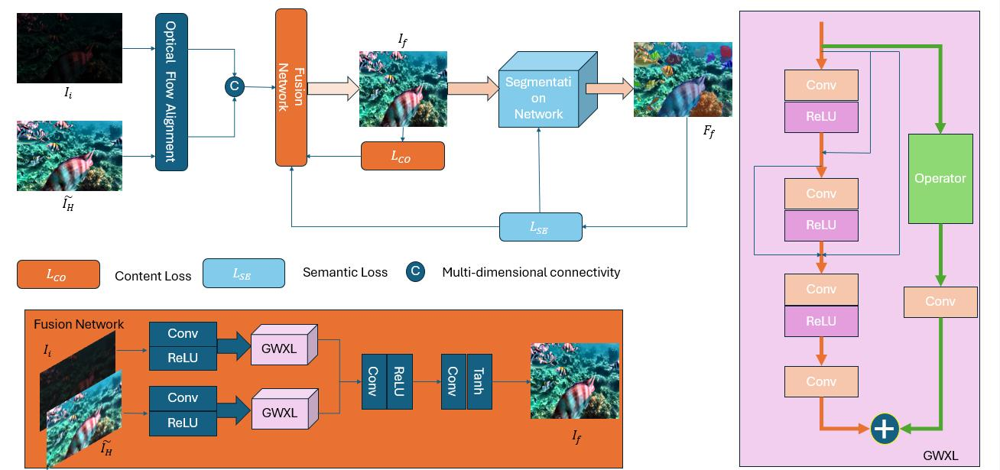

# SGNeR
Neural Representation and Semantic Segmentation for Enhanced Underwater Imaging

Because our experiments are not fully completed yet, we can only testfully publicize all the datasets used for training and how they are used.
## Overview

## Dataset
Our Our dataset is not loaded in full, if you want to get the full dataset, you can refer to this website, thanks to the author for creating this dataset and contributing to underwater imagery

https://li-chongyi.github.io/proj_benchmark.html
